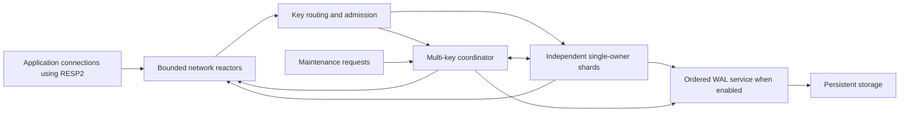

# Recall architecture

**Status:** Prototype architecture and planned storage lifecycle, not a production guarantee. The [performance design](plans/performance.md) extends the execution, growth, and checkpoint mechanisms. Implementation stages are tracked in [the roadmap](ROADMAP.md), with testing requirements in [validation and development](docs/validation.md).
**Project:** Recall, a multithreaded in-memory cache server built in Rust.

## 1. Scope and decisions

- **Scope:** Rust implementation; single-node deployment; RESP2 over TCP with a documented command set; configurable persistence with explicit guarantees.
- **Workload:** Small, independently accessed keys; mixed reads and writes; predictable tail latency as the primary performance concern.
- **Platform:** Linux is the sole Tier 1 development, testing, and deployment target. Production readiness requires substantial additional engineering and validation. Other operating systems are outside the current support scope.
- **Baseline scope:** Binary-safe strings, integer counters, expiration, atomic multi-key commands, one logical database, bounded resource use, and no eviction by default; opt-in eviction has a separate implementation gate.
- **Persistence design:** Memory-only, periodic WAL synchronization, or strict WAL synchronization. Maintenance checkpoints remain the reference path; the performance design adds online checkpoints.
- **Deferred command/deployment features:** Collections, user transactions, scripting/functions, pub/sub, blocking commands, replication, clustering, online resharding, and RESP3.
- **Execution goal:** Run independent keyspace commands in parallel, while retaining ordered access to conflicting keys and atomic publication across owners.

## 2. Protocol and consistency contract

Use RESP2 array-of-bulk-string requests and bounded pipelining. Specify and test command behavior, response types, and session negotiation. Persistent storage uses Recall's own versioned formats.

| Area | Proposed supported surface | Boundary |
| --- | --- | --- |
| Session | [`PING`, `ECHO`, `QUIT`, `AUTH`, `HELLO 2`, `SELECT 0`](crates/recall-core/src/command.rs:1) | One default authentication identity and one database. Include tested negotiation authentication/name modifiers. |
| Strings | [`GET`, `SET`](crates/recall-core/src/command.rs:1) | Binary-safe keys/values; document exact assignment options below. |
| Counters | [`INCR`, `INCRBY`, `DECR`, `DECRBY`](crates/recall-core/src/command.rs:1) | Canonical signed 64-bit parsing, checked overflow, integer return values, and expiry preservation. |
| Multi-key | [`MGET`, `MSET`, `DEL`, `EXISTS`](crates/recall-core/src/command.rs:1) | Atomic across affected shards, including multi-key reads; preserve each command's duplicate-key semantics. |
| Expiration | [`EXPIRE`, `PEXPIRE`, `TTL`, `PTTL`, `PERSIST`](crates/recall-core/src/command.rs:1) | Basic forms only initially; exact missing-key, nonpositive-timeout, rounding, and overflow behavior. |
| Discovery/metadata | [`COMMAND`, `COMMAND INFO`, `INFO`, `CLIENT SETNAME`, `CLIENT GETNAME`, `CLIENT SETINFO`](crates/recall-core/src/command.rs:1) | Enumerate real capabilities and key metadata; expose honest Recall identity and bounded client metadata. Specify supported information sections before implementation. |

- Assignment supports [`NX`, `XX`, `EX`, `PX`, `KEEPTTL`](crates/recall-core/src/command.rs:1). Conditions are mutually exclusive; expiration choices are mutually exclusive. Ordinary assignment clears the old deadline. Reject unsupported options rather than silently ignoring them.
- Reject [`HELLO 3`](crates/recall-core/src/command.rs:1) with the appropriate unsupported-protocol response. Test negotiation/fallback explicitly; clients requiring RESP3 are outside v1 support.
- Every supported keyspace command is linearizable, including read-modify-write and cross-shard reads/writes. A successful operation has an observation/validation point within its execution interval. There is no promised arrival order between independent connections.
- Process one executing command per connection initially. Parse ahead within limits, but dispatch the next command only after its predecessor reaches its configured completion boundary and its response is safely queued. Preserve response order; do not wait for the client to consume the response before making other connections progress.
- Multi-key commands preserve argument order and duplicate-key semantics. Deduplicating participant shard IDs must not accidentally deduplicate logical arguments.
- Validate grammar, argument counts, integer ranges, reply types, error prefixes, and metadata against Recall's command contract and sequential oracle. Unsupported commands fail explicitly.
- Limits on request bytes, argument count, key/value size, multi-key fan-out, and reply bytes are documented compatibility boundaries. No unbounded whole-keyspace commands in v1.
- Disconnects and timeouts do not imply cancellation. After admission a command may commit without its response arriving; automatic retries of non-idempotent commands are unsafe. No exactly-once promise.

## 3. Execution architecture

| Candidate | Benefit | Decision / risk |
| --- | --- | --- |
| One database-wide lock | Simple serialization | Reject as the main path: independent keys still contend and long operations stall everyone. |
| Shared map with sharded locks | Viable, familiar implementation | Benchmark as an alternative if needed; composite operations still require lock ordering, TTL coordination, and safe snapshot/log protocols. Cache-line movement and long lock holds remain risks. |
| Single-owner shards with message passing | Explicit ownership, local mutation, parallel independent work | Recommended baseline. Costs include routing, queueing, cross-core transfers, hot shards, and multi-key coordination. Not assumed universally faster. |

- Use a mature Rust async runtime for networking and dedicated engine-owner threads. Keep disk writes/synchronization and checkpoint serialization off network reactors and owner execution loops. Budget network, log, and maintenance threads within the same CPU allocation used in comparisons.
- Each engine thread exclusively owns its shard's mutable table, expiration index, and local accounting. No shared mutable entry access, global map lock, or independently mutable read cache. Share only immutable, lifetime-safe buffers where measured useful.
- A keyed, process-wide routing hash maps the entire binary key to a fixed owner for that process lifetime. No client-controlled shard selection or online migration. Recovery re-routes logical keys, allowing a different worker count after a restart.
- Single-shard commands, including multi-key commands whose keys share an owner, bypass the multi-key coordinator. All durable mutations still use the WAL service.
- Use bounded request and completion paths with byte as well as item limits. Reserve capacity for control/completion messages so full data queues cannot prevent commit acknowledgments or reservation release. Never wait on a slow client while holding shard reservations.
- Completion handling outlives the originating socket. A disconnected client's admitted command still reaches a terminal state and releases its response credits, log credits, and reservations; dropping a socket cannot drop a coordination acknowledgment.
- Owners use explicit execution/reservation/commit-wait states. Waiting for log completion must leave the control path serviceable; never perform blocking storage calls on an owner. Healthy storage and fair scheduling are required for liveness, not hard real-time guarantees.
- Use bounded work batches and fair admission. Controls may pause fresh data work after current executing work finishes; define quotas so neither maintenance nor client work starves. Do not drain an arbitrarily large backlog before servicing a reservation.
- The correctness baseline permits one committing operation per owner at a time, with log group commit across owners. Intra-owner batching is a later measured optimization requiring private staged state and ordered publication. Strict-mode throughput can otherwise be limited by owner count per synchronization cycle.
- Hot keys serialize on their owner; hot shards, oversized operations, and NUMA transfers limit scaling. Apply request-size limits and expose skew metrics. Optional affinity and allocator changes come only after measurement; no custom lock-free container or application-level unsafe Rust in the baseline.

## 4. Cross-shard atomicity and ordering

One coordinator serializes cross-shard commands and maintenance fences. This intentionally limits multi-key throughput; unrelated single-shard work continues. Reserve entire affected shards initially, not individual entries.

1. Parse and classify the complete command; extract all participant shards. Reserve bounded coordination, response, and potential log capacity before taking reservations where sizes are known.
2. Request participants in ascending shard order through a reserved control path. Each finishes its current operation, including pending commit, then freezes its keyspace execution and expiration work. Networking and the WAL service continue independently.
3. Once all participants are reserved, sample one wall-clock time for expiry/condition evaluation. Read a consistent view, validate the entire operation, and prepare immutable final effects. Reserve all peak apply memory; if resources are unavailable, abort preparation rather than wait for memory held by another reserved shard.
4. A read-only operation without expiry deletions can finish from this view. A mutation, including necessary expiry tombstones, creates one atomic effect record covering all participants. Memory-only mode skips the log; other modes wait for their specified log boundary.
5. Install prepared effects on every participant, using pre-reserved resources. Keep every participant reserved until all have confirmed application; only then release participants and deliver the result. No observer can see partial installation.
6. Before a log decision, validation/resource failure releases reservations without partial requested writes. After a complete log record has been accepted, never claim rollback: an apply failure is process-fatal and recovery replays the whole record. Cancellation or an uncertain log failure may leave an unknown outcome.

The logical observation/validation point is inside the fully reserved interval; publication waits for commitment. A single-owner operation follows the same prepare/commit/publish rules locally. The coordinator never waits for a frontend response flush, and the WAL service never waits for all shards to join a batch. These rules break common reservation/queue/log deadlock cycles.

This is single-process coordination backed by one recovery log, not distributed consensus. Future replication and user transactions require separate designs rather than reusing this protocol without analysis.

## 5. Memory, expiration, and overload

- Account for live keys/values, table capacity, expiration metadata, parsed input, prepared effects, response references, log buffers, and deferred reclamation. Charge retained backing allocations, not only visible slices; release allocation credits only when their final reference disappears.
- Use local credit pools with bounded global rebalancing rather than a contended atomic counter for every key access. Admission must consider temporary old-plus-new value storage and metadata growth; a replacement can exceed budget even when its final size fits.
- Reserve configured per-owner table and timer capacity at startup and expose explicit key-capacity ceilings. The conventional table is the initial reference; deletion churn can still cause implementation-dependent table maintenance. Incremental growth and strict maintenance-work bounds require the optimized storage design. Expose owner-capacity exhaustion even when other owners have space.
- The memory limit is an accounted allocation budget, not a mathematically exact RSS ceiling. Leave configurable headroom for allocator fragmentation, stacks, runtime, and kernel buffers; measure RSS and enforce separate operational limits.
- Start with no automatic eviction. Reject growth before committing it. Keep emergency capacity for reclamation, error replies, and essential log/control progress. Specify memory-pressure behavior and opt-in eviction policy explicitly.
- Bound connections, per-connection in-flight bytes, output retention, queue depth/bytes, command sizes, and global queued work. Apply socket-read backpressure and bounded admission waits; never spawn unlimited tasks or buffer indefinitely. Slow-client expiry closes that client without undoing committed commands.
- Use immutable response/log buffers with explicit ownership transfer. Offloaded destruction, if needed for large values, uses a bounded reclaimer queue and remains charged until actually freed.
- Maintain a bounded expiration index per owner, initially an indexed heap with at most one accounted timer entry per expiring key. Validate entry identity/deadline before cleanup; repeated deadline changes cannot grow unbounded stale timer entries.
- Sample absolute Unix time for command expiry decisions; use monotonic time for scheduling and wait budgets only. Persist absolute deadlines. Wall-clock jumps can shorten or extend keys not yet deleted; this is explicit and tested, not hidden by mixing incompatible clocks.
- Check expiry on every access and reclaim incrementally with a work budget. Expired values are never returned. Cleanup cannot race a replacement or bypass a shard reservation.
- Expiry removal is an ordered deletion effect in persistent modes, not an unlogged table erase. A read discovering expiry may therefore need a log commit before completing. Durable tombstones prevent already durably removed keys from returning after a clock rollback. Unsynchronized deletions remain subject to periodic mode's loss contract.
- Future eviction must specify selection, cross-shard budget fairness, logging of removal, and observable behavior first. It is not a background thread allowed to mutate owners' tables.

## 6. Persistence and recovery

### Acknowledgment contract

| Mode | Boundary before publication and successful response | Recovery promise |
| --- | --- | --- |
| Memory-only | Complete atomic in-memory application | No restart durability; no implicit persistence loading/writing. |
| Periodic WAL | Complete record written to the OS, then applied | Recovery uses a valid log prefix. An acknowledged suffix not yet synchronized may be lost after OS/power failure. Process-only crashes commonly retain OS-buffered writes, but that is not the advertised durability guarantee. |
| Strict WAL | Complete record written and synchronization confirmed through its sequence number, then applied | Acknowledged mutations survive crashes only under the stated filesystem/device flush assumptions. No availability or protection against media corruption is implied. |

- A configured periodic synchronization interval is a target, not a hard maximum-loss window: scheduling and device stalls can extend it. Report durable watermark, synchronization lag, and failures. Group commit is allowed in strict mode, but a response cannot precede its own durable watermark.
- Persistence mode is a startup-level choice initially. Changing it or opening an existing persistent directory must be explicit; memory-only startup must not silently abandon existing persistent state. Enforce exclusive process ownership of a data directory.
- One WAL service assigns a monotonically increasing sequence and writes versioned, length-bounded, checksummed records. Record the dataset identity and final logical effects: keys, replacement bytes plus absolute deadlines, or tombstones. Do not replay conditional commands, increments, or relative timeout calculations.
- A cross-shard mutation is one indivisible record. Per-owner execution order must be reflected in log order; independent-shard records can interleave because their effects commute. Do not expose effects before the selected boundary, or later operations could depend on writes absent from recovery.
- A complete valid record is a recovery decision, even when the client never received a response. Short writes must be handled explicitly. Uncertain persistence failures stop data service; do not continue accepting writes or present an uncommitted in-memory view as trustworthy.
- Use bounded group size/bytes and a bounded batching delay. Never require participation from every owner to flush. Expose the single WAL writer as an intentional global write-bandwidth bottleneck; per-shard logs are deferred because they complicate atomic recovery and snapshot cuts.
- Segments have validated headers, sequence continuity, and sealed/active state. Recovery tolerates only a demonstrably incomplete tail of the final active segment; reject interior corruption, invalid checksums, missing segments, incompatible formats, or unsafe fallback. A process kill is not a power-loss test.
- Replay a valid checkpoint plus its contiguous log suffix before accepting traffic. Rebuild ownership and timers from logical records. Expire overdue recovered entries through the normal logged-deletion path before readiness; do not silently discard persisted entries and then permit resurrection after a later clock rollback.
- Refuse readiness if recovery exceeds configured resources or encounters corrupt state; never start with a partially restored dataset. Unexpected owner/coordinator panics are process-fatal, not independent worker restarts.
- On graceful shutdown, stop admissions, drain accepted work, complete pending decisions, synchronize enabled persistence, then close. Report failure rather than claiming a clean shutdown when synchronization fails.

### Checkpoints and storage lifecycle

The initial checkpoint is an explicit, observable maintenance operation for persistent modes. Invoke it through a separately secured local administrative interface. Avoid process-fork snapshots of a multithreaded Rust runtime.

1. Reserve checkpoint buffers and coordinate maintenance with the same reservation authority. Stop new keyspace admissions with a documented busy response and drain accepted work; keep the maintenance state visible to health/metrics.
2. Reserve all owners, finish pending commits, and synchronize the WAL to a common cut. Keep owners quiescent for the entire streaming checkpoint. Serialize complete logical entries and stored deadlines, including overdue entries not yet removed; do not silently change state while claiming the same cut.
3. Owners emit bounded owned or immutable entry batches to the serializer; no background thread borrows mutable tables. Charge retained batches until released. Write a new generation and verify its counts/checksums. Synchronize snapshot contents, atomically publish its manifest, and synchronize directory metadata with a tested platform-specific ordering.
4. Only after durable publication may covered log segments and obsolete snapshots be reclaimed. Retain sufficient prior state until that point. Recovery must verify a complete published generation and log coverage; never silently choose an older state that could discard committed mutations.
5. Release owners and restore admissions. Failed checkpoints leave the previous recoverable state intact; uncertain storage health invokes the persistence failure policy.

Checkpoint duration and rejected work are reported separately from steady-state latency. Enforce WAL retention/disk headroom limits and backpressure before disk exhaustion. Maintenance pauses and log growth are real v1 operational costs; an online snapshot design is required before claiming uninterrupted checkpointing. Backups must capture a validated checkpoint and required log suffix, with restore tests.

## 7. Security, operations, and implementation boundaries

- Default to loopback binding. Nonlocal deployment requires explicit configuration, authentication, and TLS or a documented trusted private TLS-termination path. Use maintained libraries; do not design custom cryptography. Default-user authentication and multi-user access controls are separate implementation stages.
- Bound unauthenticated parsing, connection establishment, credentials, and client metadata. Keep credentials, values, and raw keys out of logs. Restrict administration/metrics exposure and cap metric-label cardinality.
- Export per-owner queue depth/bytes, execution and queue-wait histograms, skew, memory categories, expiration backlog, coordinator phase waits, log append/sync latency, durable lag, overload rejections, slow-client retention, and checkpoint state. Aggregate without a hot-path global metrics lock.
- Organize the future Rust workspace into protocol/command metadata, deterministic engine/coordinator, persistence, server integration, and test/benchmark boundaries. The engine uses injected clocks and log outcomes, not direct sockets, filesystem access, or ambient time.
- Start with safe Rust, mature bounded queues, a conventional allocator, and a maintained networking/TLS stack. Pin dependency versions and the minimum Rust toolchain during implementation. Native Linux optimizations are optional, measured layers, not correctness requirements.
- Future Linux production qualification requires real filesystem synchronization, directory publication, restart, and crash testing on the intended filesystems. Successful normal restarts alone do not establish power-loss guarantees.

## 8. Proof obligations and release gates

- **Sequential oracle:** Build the deterministic string/counter/expiry reference model and per-command vectors first. Test binary data, duplicate keys, condition combinations, missing values, overflow, auth/negotiation, and configured resource boundaries.
- **Concurrent correctness:** Check histories against a linearizable model across independent clients, pipelines, single-key read-modify-write, and overlapping cross-shard reads/writes. Include incomplete requests and explicit virtual-clock events. Model-check small owner/coordinator/log state machines and control-queue liveness; safe Rust alone does not prove atomicity.
- **Fault matrix:** Inject failures before/after preparation, record completion, synchronization, each participant application, release, snapshot synchronization, manifest publication, directory synchronization, and old-segment deletion. Test full/stalled disks, short writes, corrupt lengths/checksums, process death, owner panic, and interrupted shutdown.
- **Recovery assertions:** No partial cross-shard mutation; strict acknowledged writes and durable deletions survive supported crashes; periodic recovery is a valid prefix and may include unacknowledged requests. Test clock jumps and restart with different owner counts. Use VM/block-device crash experiments for power-loss claims, not process termination alone.
- **Resource/adversarial tests:** Fuzz protocol and recovery parsers; test full data/control queues, giant arguments, hot-key traffic, repeated expiry changes, expiry storms, slow clients, output retention, memory pressure, and snapshot/log resource exhaustion. Check that abort/release paths leak neither reservations nor credits.
- **Performance matrix:** Compare one owner through the available core counts using uniform and skewed keys, one hot key, mixed/read-heavy/write-heavy traffic, several value sizes, multi-key fractions, persistence modes, and overload. Include large-value and checkpoint behavior even though they are not the baseline workload.
- **Reproducible measurement:** Pin hardware, CPU budget including auxiliary threads, OS, compiler/build, dataset, client versions, pipeline depth, transport/security, and durability mode. Report offered load, successful throughput, rejections, queue depth, p50/p95/p99/p99.9, memory, CPU, synchronization lag, and recovery/checkpoint results. Use an open-loop or coordinated-omission-corrected load generator.
- **Performance acceptance:** Establish numeric latency, memory, and throughput thresholds on representative hardware. Track hot-key behavior, multi-key stalls, peak memory, and durability alongside uniform-key throughput. Retain correctness tests when optimizing.

## 9. Baseline implementation gates

The [performance design](plans/performance.md) and [roadmap](ROADMAP.md) define the integrated execution order. Retain simpler mechanisms as reference paths for validating optimized implementations.

1. Define the command matrix, failure contract, protocol vectors, and testable invariants; maintain the Rust workspace and Linux CI checks.
2. Implement a deterministic single-thread engine and virtual-clock oracle, including string/counter/expiry semantics and resource reservations; establish conformance/property tests.
3. Implement bounded RESP2 networking, session/authentication/negotiation, ordered connection execution, and explicit overload behavior. Keep development exposure loopback-only until security gates pass.
4. Introduce configurable single-owner workers, routing, bounded data/control paths, and per-owner observability. Prove single-key ordering and shutdown behavior before adding coordination.
5. Implement cross-shard prepare/commit/publish and maintenance reservations; pass linearizability, cancellation, starvation, and queue-deadlock tests in memory-only mode.
6. Finish byte-accurate resource categories, expiration cleanup, no-eviction admission, slow-client handling, and bounded reclamation; pass adversarial resource tests.
7. Implement the versioned effect log, replay, periodic/strict boundaries, group commit, failure-stop policy, and exclusive directory ownership. Pass mutation-level crash tests before checkpoint work.
8. Implement maintenance checkpoints, durable manifests, segment reclamation, startup expiry, backup/restore validation, and crash-injected storage lifecycle tests.
9. Complete TLS/auth hardening, capability reporting, operational metrics, platform qualification, packaging, and operational documentation; publish the supported command and protocol contract.
10. Run the reproducible correctness/performance matrix; set and meet hardware-specific acceptance thresholds. Only then evaluate batching, affinity, allocator changes, or an alternative concurrency model.

**Implementation direction:** Extend the correctness baseline with finer-grained coordination, bounded table growth, pipelined logging, and online maintenance while preserving resource bounds and durability guarantees.
